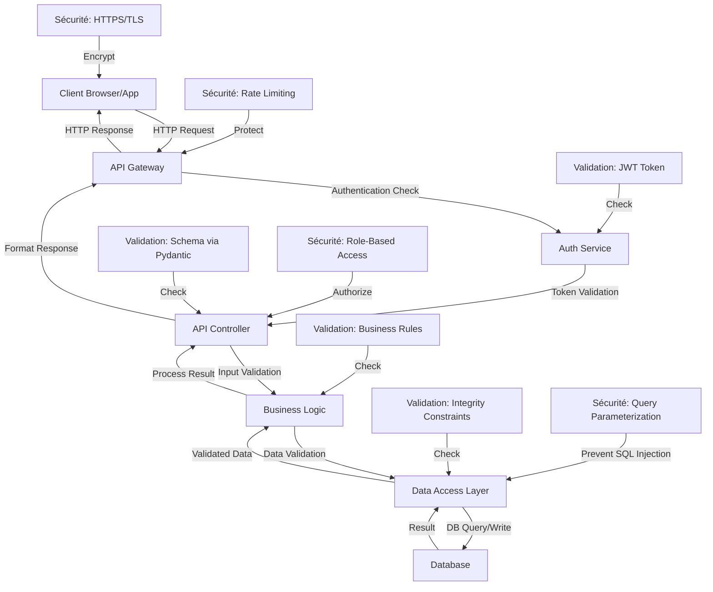

# 2. Fiabilité des Données

Ce document présente les méthodes mises en œuvre pour garantir la fiabilité des données tout au long du flux d'utilisation de notre API BuyYourKawa.

## 2.1 Diagramme de Flux des Données



## 2.2 Méthodes de Validation

| Couche | Méthode de Validation | Description | Implémentation |
|--------|------------------------|-------------|----------------|
| **Transport** | HTTPS/TLS | Chiffrement des communications | Configuration du serveur web |
| **API Gateway** | Rate Limiting | Limitation du nombre de requêtes | Middleware de limitation (429 Too Many Requests) |
| **Authentification** | JWT Validation | Vérification des tokens d'accès | `oauth2_scheme` dans l'API |
| **Contrôleurs** | Schema Validation | Validation des structures de données | Modèles Pydantic dans `models.py` |
| **Service** | Business Rules | Règles métier (ex: unicité email) | Vérifications avant opérations DB |
| **Data Access** | Parameterized Queries | Protection contre les injections SQL | ORM ou requêtes paramétrées |
| **Database** | Constraints | Contraintes d'intégrité | Clés primaires, index, foreign keys |

## 2.3 Code Source des Validations

### Validation des Modèles (Pydantic)

```python
# Extrait de models.py
from pydantic import BaseModel, EmailStr, Field, validator
import re

class Address(BaseModel):
    street: str = Field(..., min_length=1, max_length=200)
    city: str = Field(..., min_length=1, max_length=100)
    zip: str = Field(..., min_length=1, max_length=20)
    country: str = Field(..., min_length=1, max_length=100)

class Client(BaseModel):
    name: str = Field(..., min_length=2, max_length=100)
    email: EmailStr
    phone: str
    address: Address
    
    @validator('phone')
    def phone_format(cls, v):
        # Validation format téléphone international
        pattern = r'^\+?[1-9]\d{1,14}$'
        if not re.match(pattern, v):
            raise ValueError('Invalid phone number format. Use E.164 format (e.g. +33123456789)')
        return v
```

### Validation d'Authentification

```python
# Extrait pour la validation des tokens
from fastapi import Depends, HTTPException, status
from fastapi.security import OAuth2PasswordBearer

oauth2_scheme = OAuth2PasswordBearer(tokenUrl="token")

async def get_current_user(token: str = Depends(oauth2_scheme)):
    credentials_exception = HTTPException(
        status_code=status.HTTP_401_UNAUTHORIZED,
        detail="Could not validate credentials",
        headers={"WWW-Authenticate": "Bearer"},
    )
    
    try:
        payload = jwt.decode(token, SECRET_KEY, algorithms=[ALGORITHM])
        username: str = payload.get("sub")
        if username is None:
            raise credentials_exception
    except JWTError:
        raise credentials_exception
        
    user = get_user(username=username)
    if user is None:
        raise credentials_exception
    return user
```

### Tests Automatisés

```python
# Extrait de test_main.py
def test_create_client():
    client_data = {
        "name": "Test Client",
        "email": "test@example.com",
        "phone": "+33123456789",
        "address": {
            "street": "123 Test Street",
            "city": "Test City",
            "zip": "12345",
            "country": "France"
        }
    }
    
    response = client.post(
        "/clients",
        json=client_data,
        headers={"Authorization": f"Bearer {token}"}
    )
    
    assert response.status_code == 200
    data = response.json()
    assert "id" in data
    assert data["name"] == client_data["name"]
    assert data["email"] == client_data["email"]
```

## 2.4 Sécurité du Stockage et des Flux

### Sécurisation des Données Sensibles

| Type de Donnée | Méthode de Protection | 
|----------------|------------------------|
| Mots de passe  | Hachage avec bcrypt + salt |
| Tokens d'accès | Courte durée de vie (30min) + refresh tokens |
| Données personnelles | Chiffrement en base de données |
| Communications | TLS 1.3 de bout en bout |

### Logs et Audit

- Journalisation des accès et modifications
- Horodatage automatique (created_at, updated_at)
- Traces d'audit pour modifications sensibles

## 2.5 Intégrité Front/Back

| Point de Vérification | Front-End | Back-End | 
|------------------------|-----------|----------|
| Validation des formulaires | JavaScript (client-side) | Pydantic (server-side) |
| Format email | Regex pattern | EmailStr validator |
| Format téléphone | Input mask | Validator personnalisé |
| Structure JSON | Typage TypeScript | Schéma Pydantic |
| États d'erreur | Affichage contextuel | Codes HTTP + messages JSON |

Cette double validation garantit que les données restent cohérentes même en cas de bypass de la validation côté client.
