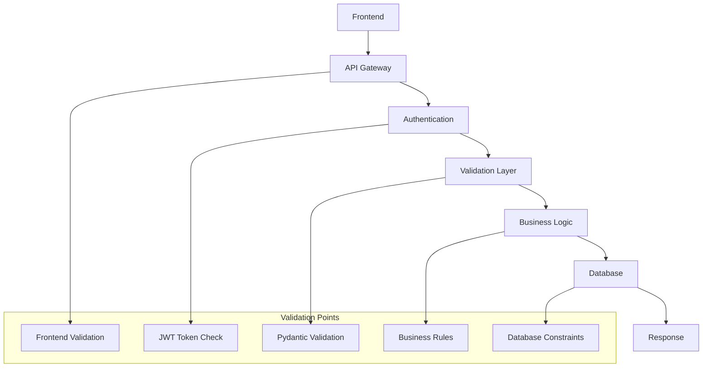
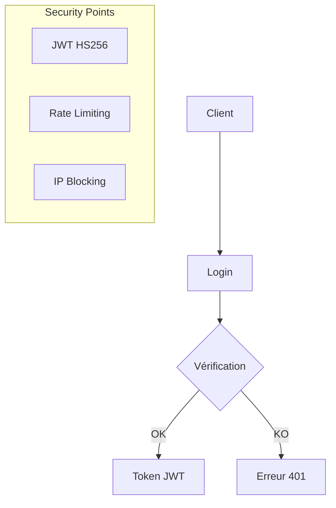
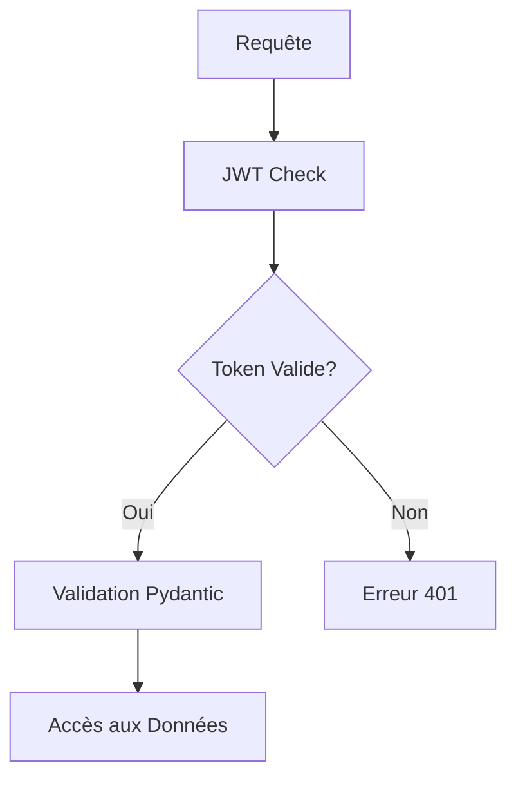
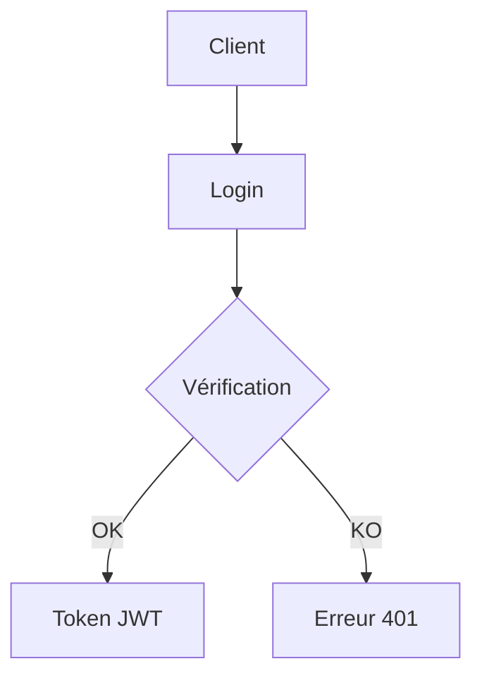

# Documentation de Sécurisation & Fiabilité

## Objectifs
- Prouver que les données sont protégées et valides
- Garantir la cohérence entre front, back, et DB

## Mécanismes de Validation

### 1. Tests Automatisés
```python
# test_main.py
from fastapi.testclient import TestClient
from main import app
import pytest

client = TestClient(app)

def test_token_auth():
    response = client.post(
        "/token",
        data={"username": "test", "password": "test"}
    )
    assert response.status_code == 200
    assert "access_token" in response.json()

def test_client_creation():
    token = get_test_token()
    headers = {"Authorization": f"Bearer {token}"}
    
    response = client.post(
        "/clients",
        json={
            "name": "Test Client",
            "email": "test@example.com",
            "phone": "+33123456789",
            "address": {
                "street": "123 Rue Test",
                "city": "Paris",
                "zip": "75000",
                "country": "France"
            }
        },
        headers=headers
    )
    assert response.status_code == 200
    assert "id" in response.json()

def test_invalid_phone():
    token = get_test_token()
    headers = {"Authorization": f"Bearer {token}"}
    
    response = client.post(
        "/clients",
        json={
            "name": "Test Client",
            "email": "test@example.com",
            "phone": "123456789",  # Format invalide
            "address": {
                "street": "123 Rue Test",
                "city": "Paris",
                "zip": "75000",
                "country": "France"
            }
        },
        headers=headers
    )
    assert response.status_code == 422
    assert "Format : +33XYYYYYYY" in response.json()["detail"][0]["msg"]
```

### 2. Validation des Données

#### Frontend → Backend


### 3. Méthodes de Validation

#### a. Frontend
| Champ | Type | Contraintes | Validation |
|-------|------|-------------|------------|
| name | string | 2-100 chars | Required |
| email | email | RFC 5322 | Required |
| phone | string | 10-20 chars | Required |
| address.street | string | 2-100 chars | Required |
| address.city | string | 2-50 chars | Required |
| address.zip | string | 5 digits | Required |
| address.country | string | 2-50 chars | Required |

#### b. Backend
| Point | Méthode | Description |
|-------|---------|-------------|
| Token | JWT HS256 | Vérification signature |
| Permissions | OAuth2 | Vérification des scopes |
| Rate Limit | HTTP | Contrôle des requêtes |
| Email | EmailStr | Format email valide |
| Phone | Regex | Format +33XYYYYYYY |
| Zip | Regex | 5 chiffres |
| Timestamps | datetime | Format ISO 8601 |

### 4. Sécurité des Flux

#### a. Authentification


#### b. Accès aux Données


### 5. Intégrité des Données

#### Contraintes de Base de Données
| Champ | Contrainte | Description |
|-------|------------|-------------|
| client_id | UNIQUE | ID unique par client |
| email | UNIQUE | Email unique par client |
| created_at | NOT NULL | Timestamp de création |
| updated_at | NOT NULL | Timestamp de mise à jour |

#### Validation Métier
| Règle | Description | Implémentation |
|-------|-------------|----------------|
| Client ID | UUID v4 | Génération unique |
| Timestamps | Auto | Mise à jour automatique |
| Address | Completeness | Tous les champs requis |
| Phone | Format | +33XYYYYYYY |
| Zip | Format | 5 chiffres |

### 6. Format des Données

```json
{
  "client": {
    "id": "uuid_v4",
    "name": "string",
    "email": "email@domain.com",
    "phone": "+33XYYYYYYY",
    "address": {
      "street": "string",
      "city": "string",
      "zip": "XXXXX",
      "country": "string"
    },
    "created_at": "datetime",
    "updated_at": "datetime"
  }
}
```

## Points de Sécurité Critiques

### 1. Authentification


### 2. Accès aux Données


## Recommandations de Sécurité

### 1. Bonnes Pratiques

1. **Validation des Données**
   - Utiliser Pydantic pour la validation
   - Implémenter des regex strictes
   - Limiter les longueurs maximales

2. **Authentification**
   - Tokens JWT avec HS256
   - Vérification des permissions
   - Rate limiting

3. **Monitoring**
   - Prometheus metrics
   - Logs sécurisés
   - Alerting sur anomalies

### 2. Format des Données

```json
{
  "client": {
    "name": "string",
    "email": "email@domain.com",
    "phone": "+33XYYYYYYY",
    "address": {
      "street": "string",
      "city": "string",
      "zip": "XXXXX",
      "country": "string"
    }
  }
}
```
